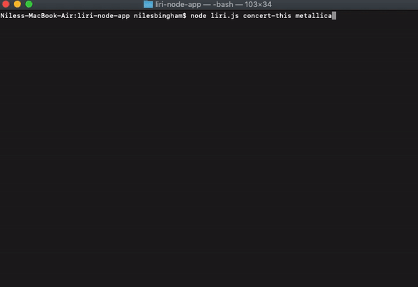
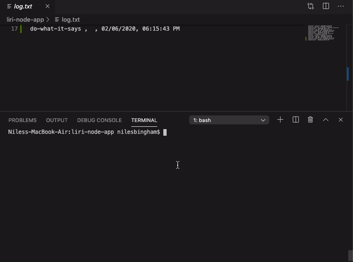
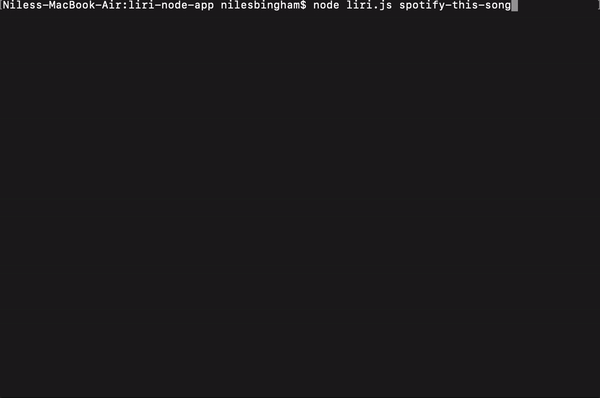
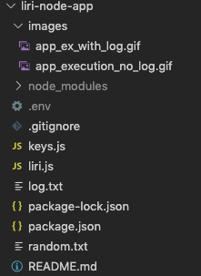

# 
liri-node-app

### App Visuals

App usage and output

App usage with command log

Empty arguments response

File tree

## Overview

This is `LIRI`, Language Interpretation and Recognition Interface, a CLI node app that takes in parameters and returns data based on key words used.

### How to use

`LIRI` has 4 commands to call after using node and the file name as the first two parameters. `concert-this`, `movie-this`, `spotify-this-song`, and `do-what-it-says`.

- `concert-this`: After this command type in any band or artist to check if they have any upcoming shows. This is based on BandsInTown's API

  - If they do a list of venues with the city and date will be displayed in the console.

- `movie-this`: After this command type any movie that you would like to see the data on. This is based on OMDB's API.

  - If the movie is in OMDB's database the data displayed in the console will be:
    - title of the movie
    - release year
    - IMDB's and Rotten Tomatoes rating
    - country where the movie was produced
    - language
    - a short plot of the movie
    - a list of actors and actresses
  - If no argument is typed in after the command the data displayed will revert to Mr. Nobody.

- `spotify-this-song`: After this command type a name of a song you would like the data on. The reply is based on spotify's API.

  - If the song is in Spotify's database the data displayed will be:
    - Artist's Name
    - Name of the song
    - A preview link of the song if available
    - The album the song is from
  - If no song is entered after the command the data will revert to "The Sign" by Ace of Base.

- `do-what-it-says`: This is a wild card command there is data written in a file called random.txt. The program will read the content then run based on the command and argument in the file.
  - The file with this app will run `spotify-this-song I want it that way`.

All commands given will be stored in a log file with arguments, the date and time of use.

## Technologies used

1. Node.js
2. moment.js npm package
3. node-spotify-api npm package
4. axios npm package
5. dotenv npm package
6. OMDB API
7. BandsInTown API
8. VS Code
9. Github

## Role

**Niles Bingham** - _Developer_
